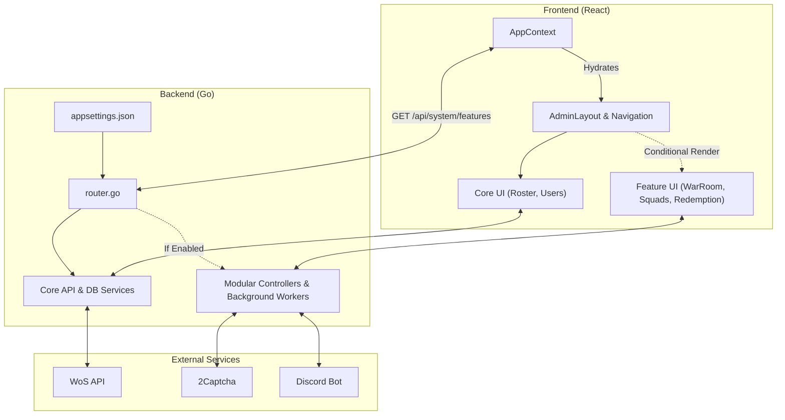

# WoS Dashboard: Alliance Command Console


A lightweight, modular **state management dashboard for Whiteout Survival (WoS)**.

WoS Dashboard provides R4/R5 leadership with a centralized interface to manage **players, alliances, events, transfers, and reservations**—replacing scattered spreadsheets, Google Docs, and manual Discord coordination.

Originally built as a gift code redeemer, the project has evolved into a highly scalable, **feature-toggled operational dashboard** tailored for real WoS leadership workflows.

---

## 📸 Screenshots & Demo

*(Coming soon)* | [📺 **YouTube Walkthrough**](#) *(link coming soon)*

---

## 🎯 Why This Exists

Running a WoS state often requires juggling multiple Google Sheets, Discord reminders, fortress rotation spreadsheets, manual ministry tracking, and the general coordination chaos during SvS and Tyrant.

WoS Dashboard consolidates everything into **one lightweight, modular platform** designed specifically to give state leadership a single place to run the entire state.

---

## ✨ Core Features & Modules

The application is built on a **modular architecture**. The core system runs the basic roster and authentication, while heavy features (like Gift Codes or Discord integrations) can be toggled on or off in the configuration to save server memory and simplify the UI.

### 🛡️ The Core OS (Always On)
* **State Roster Ledger:** Complete management of players, alliances, and furnace levels synced via the WoS API.
* **Role-Based Access Control:** Secure Admin/Moderator tiers.
* **Enterprise Security:** Support for Standard Passwords, **TOTP Authenticator Apps**, and **WebAuthn (Biometrics/Passkeys)**.
* **Player Dashboard:** A restricted view where players can log in using their Game ID to view their specific deployments.
* **Audit Logging & Backups:** Comprehensive action tracking and automated, encrypted database backups (AWS, GCP, Cloudflare R2).

### 🧩 Toggleable Modules
* **⚔️ War Room & Squads:** Coordinate SvS fighting alliances, rally teams, and troop formations with real-time UI synchronization.
* **🏛️ Ministry Reservations:** Streamline SvS ministry schedules with custom templates and history tracking.
* **🏰 Fortress Rotation:** Plan and allocate seasonal fortress and stronghold rotations.
* **✈️ Transfer Manager:** Manage inbound/outbound transfers, track season caps (Normal/Special invites), and onboard players directly to the roster.
* **⚙️ Foundry & Canyon Clash:** Manage alliance-based event coordination, legion assignments, and attendance histories.
* **🤖 Discord Integration:** Automated, taggable cron reminders for rotations, ministries, troop deployments, and pet schedules.
* **🎁 Gift Code Engine:** Live, batched redemption tracking with CSV reporting (Requires external 2captcha service).

---

## 🏗️ Architecture

The system utilizes a modular Go backend with an injected configuration state. The React frontend dynamically hydrates its UI based on the backend's active feature flags.



### Tech Stack
* **Backend:** Go (Gorilla Mux / Gin)
* **Frontend:** React + Vite + TailwindCSS
* **Database & Cache:** MySQL + Redis
* **Deployment:** Docker + OpenResty/Nginx Reverse Proxy

---

## 🚀 Installation & Deployment

The project is designed to be deployed via **Docker Compose**.

### 1. Configure the Backend Toggles (`appsettings.json`)
```bash
mv appsettings-example.json appsettings.json
vim appsettings.json
```
Define your MySQL credentials, Discord token, and WoS State ID. **Crucially, configure your active modules here:**
```json
"Features": {
    "GiftCodes": false, 
    "Discord": true,
    "WarRoom": true,
    "Transfers": true
    // ... toggle features to tailor your dashboard
}
```
*(Note: Remove all comments from the JSON file before starting the application).*

### 2. Configure Environment Variables (`.env`)
```bash
mv .env.example .env
vim .env
```
Set your secure credentials:
* MySQL passwords
* S3-compatible backup credentials
* GPG key email identifier

### 3. Configure Frontend API Target
```bash
vim dashboard/src/api/client.js
```
Point this to your backend (Default: `http://localhost:8080/api`).

### 4. Start the Stack & Fetch Assets
```bash
docker compose up -d

# Run the asset scraper once after the first startup to populate hero/item images:
docker exec scraper ./scraper
```

### 💡 Production Recommendations
The included Nginx configuration is for local testing. For production deployments, it is highly recommended to:
* Configure a proper domain via Dynamic DNS (e.g., [No-IP](https://www.noip.com)).
* Enable HTTPS via [Let's Encrypt](https://letsencrypt.org).
* Reconfigure Nginx to act as a secure reverse proxy.

---

## 🗺️ Roadmap

* Write comprehensive unit and integration tests for the Go API.
* Expand multi-state support for cross-server coalitions.
* Enriched SSE Payloads.

---

## 🤝 Contributing & Support

Contributions are highly encouraged!
1. Fork the repository
2. Create a feature branch
3. Submit a pull request

**Support the Project:**
If this dashboard brings order to your state's chaos, consider supporting the development:
* ☕ [Donate via PayPal](https://www.paypal.com/donate/?business=J56LZPAC5G5YA&no_recurring=0&currency_code=EUR)
* ❄️ Send some Frost Stars in-game to: **57030176** ([Top-up Center](https://store.centurygames.com/wos))

---

## 📄 License

This project is licensed under the **MIT License**. You are free to use, modify, distribute, and run this privately, provided the original license is included.